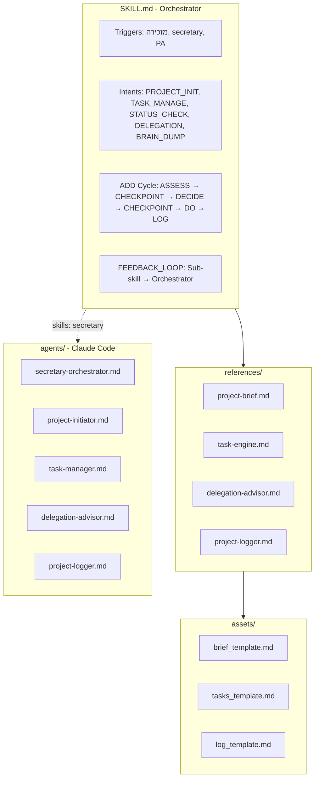

# Secretary System Implementation Plan v2.2

## Summary

Building the Secretary System as defined in [secretary_system_architecture.md](secretary_system_architecture.md), using Anthropic's skill authoring best practices:

- **Structure**: `references/` pattern (progressive disclosure) instead of nested `sub-skills/`
- **Location**: `~/skills/secretary/` (dev) → packaged as `.skill` for Claude AI
- **Cross-interface**: Works as Skill (Claude AI) AND Agent (Claude Code)

## Architecture



## File Structure

```
~/skills/secretary/
├── SKILL.md                    # Main orchestrator + FEEDBACK_LOOP
├── references/
│   ├── project-brief.md        # Brain dump → brief
│   ├── task-engine.md          # CRUD + Taskmaster MCP
│   ├── delegation-advisor.md   # 6 AGENT_PROFILES
│   └── project-logger.md       # 9 LOG_ENTRY_TYPES
├── assets/
│   ├── brief_template.md
│   ├── tasks_template.md
│   └── log_template.md
├── scripts/
│   ├── init_project.py
│   └── sync_taskmaster.py
└── agents/
    ├── secretary-orchestrator.md
    ├── project-initiator.md
    ├── task-manager.md
    ├── delegation-advisor.md
    └── project-logger.md
```

## Gaps Filled from Architecture

| Gap | Where | Content |

|-----|-------|---------|

| FEEDBACK_LOOP | SKILL.md | Sub-agent feedback aggregation after each action |

| LOG_ENTRY_TYPES | ref-logger | 9 types: PROJECT_CREATED, TASKS_DEFINED, TASK_COMPLETED, TASK_DELEGATED, DECISION_MADE, BLOCKER_IDENTIFIED, BLOCKER_RESOLVED, MILESTONE_REACHED, OUTPUT_DELIVERED |

| AGENT_PROFILES | ref-delegation | claude_code, gemini, chatgpt, human_omer, taskmaster, other_mcps (monday, drive, gmail) |

## Execution Plan

### Phase 0: Setup

Create directory structure (`~/skills/secretary/` with subdirs)

### Phase 1A: Core SKILL.md

1. YAML frontmatter with bilingual triggers
2. Intent recognition (5 intents)
3. ADD Cycle governance with checkpoints
4. **FEEDBACK_LOOP section** (from architecture)
5. References linking
6. Bilingual examples

### Phase 1B-C: References + Templates (PARALLEL)

- `project-brief.md`: Brain dump transformation flow
- `task-engine.md`: Taskmaster MCP integration
- `delegation-advisor.md`: **6 full AGENT_PROFILES**
- `project-logger.md`: **9 LOG_ENTRY_TYPES** + history queries
- 3 templates in `assets/`

### Phase 1D-E: Agents + Scripts

- 5 Claude Code agent definitions (mirror the skill)
- `init_project.py`: Project initialization
- `sync_taskmaster.py`: Living docs ↔ Taskmaster

### Phase 1F: Deploy to Claude Code

- Symlink agents to `~/.claude/agents/`
- Verify loading

### Phase 2: Testing

- Test each component + full E2E workflow

### Phase 3: Package for Claude AI

- Create `package_skill.py`
- Generate `secretary.skill` ZIP
- Upload and verify in Claude AI

## Key Implementation Details

### FEEDBACK_LOOP (add to SKILL.md)

```yaml
FEEDBACK_LOOP:
  description: |
    After each sub-skill completes, it returns feedback:
    - What worked well
    - What was unclear
    - Suggested improvements
  storage: "Accumulated in orchestrator context for session"
```

### LOG_ENTRY_TYPES (add to ref-logger)

```
PROJECT_CREATED | TASKS_DEFINED | TASK_COMPLETED
TASK_DELEGATED | DECISION_MADE | BLOCKER_IDENTIFIED
BLOCKER_RESOLVED | MILESTONE_REACHED | OUTPUT_DELIVERED
```

### AGENT_PROFILES (ensure in ref-delegation)

- claude_code: Building, coding, deployment
- gemini: Research, multi-doc analysis
- chatgpt: Creative writing, brainstorming
- human_omer: Strategic decisions, reviews
- taskmaster: Task CRUD via MCP
- other_mcps: monday, google_drive, gmail

## Stats

| Metric | Value |

|--------|-------|

| Total Tasks in Taskmaster | 37 |

| Max Parallel Execution | 8 tasks |

| Phases | 7 (0-3) |

| Core Files | 13 |

| Dependencies Optimized | Yes |